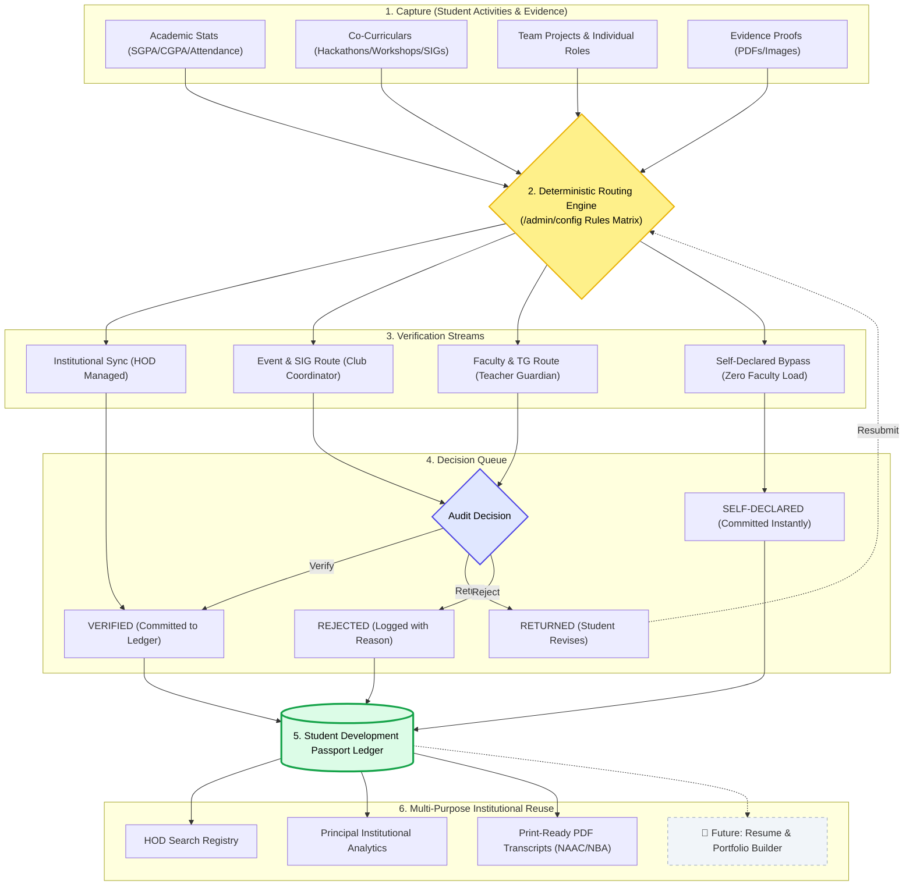

# StudentSetu (स्टूडेंट सेतु) — Student Development Passport Portal

<div align="center">


### **A Centralised, Evidence-Aware, and Appropriately Verified Student Development Passport for Higher Educational Institutions (HEIs)**

[](https://nextjs.org/)
[](https://react.dev/)
[](https://www.typescriptlang.org/)
[](https://tailwindcss.com/)
[](https://www.prisma.io/)
[](https://www.postgresql.org/)
[](https://recharts.org/)
[](https://lucide.dev/)
[](https://student-setu-iota.vercel.app)

---

**🌐 Live Production:** [https://student-setu-iota.vercel.app](https://student-setu-iota.vercel.app) | **📂 Repository:** [GitHub](https://github.com/pjha91275/SIH_2026)  
**👥 Team:** Team Samadhan | **🏛️ College:** Thakur College of Engineering and Technology (TCET), Mumbai  
**🎓 Department:** Computer Engineering (COMP) | **🏆 Event:** SIH 2026 Internal College Hackathon  
**🎯 Problem Statement:** **SIH25093** *(Centralised Digital Platform for Comprehensive Student Activity Record in HEIs)*  
*(Adopted from official SIH 2025 PS repository under institutional guidance as new 2026 PS were pending release)*  
**🌱 Theme:** SDG 4 — Quality Education | **Category:** Software  

</div>

---

## 📌 Executive Summary & TCET Field Observation

Field observations in the **Department of Computer Engineering at TCET, Mumbai** revealed acute data fragmentation in engineering colleges:
* **Scattered Records:** Student achievements are lost across Google Forms, WhatsApp groups, spreadsheets, and personal Drive links.
* **Faculty / TG Burnout:** Routing every minor workshop or self-study course to Teacher Guardians causes extreme verification fatigue.
* **The Team Project Fallacy:** In capstone and hackathon teams, existing systems credit everyone with all technologies, obscuring individual contributions (e.g., who built the backend APIs vs. who designed the UI).
* **Accreditation Crunch:** When **NAAC (Criterion 5), NBA, IQAC, or NIRF** audits occur, departments spend weeks chasing students for lost proofs.

> [!NOTE]
> **Core Architectural Philosophy:** StudentSetu does **not** replace an institution's ERP (e.g., SAMARTH) or SIS. It acts as an **evidence-aware student-development middleware layer** that captures, verifies, structures, and formats student developmental intelligence.

### 🔄 Impact & Benefits: Before vs. After

| Stakeholder | Before StudentSetu | After StudentSetu (Our Solution) |
| :--- | :--- | :--- |
| 👨‍🎓 **Students** | Scattered records, lost proofs, zero skill clarity. | **One verified passport profile**, searchable timeline, lifelong verifiable record. |
| 👨‍🏫 **Faculty / TG** | Manual collection, verification backlog fatigue. | **Focused evidence-based routing**, verified individual contributions, fast audit. |
| 🏛️ **Administration** | Limited visibility, panic during NAAC/NBA visits. | **Real-time department analytics**, institutional registry, print-ready audit reports. |

---

## ⚖️ Implementation Scope: Developed MVP vs. Future Scope

To maintain complete engineering transparency, here is the exact demarcation between what is **fully implemented in this codebase** vs. **conceptual vision from `Final Team_Samadhan_SIH2026_Solution.pptx`**:

| Capability / Module | Status in Codebase | Classification | Location in Project |
| :--- | :---: | :--- | :--- |
| **Unified Student Passport & Dashboard** | ✅ **Implemented** | Working Core MVP | `/student/dashboard`, `/student/passport` |
| **Deterministic Verification Routing Engine** | ✅ **Implemented** | Working Core MVP | Prisma routing rules + `/admin/config` |
| **Granular Team Project Disaggregation** | ✅ **Implemented** | Working Core MVP | `ProjectContribution` model (role + stack) |
| **Dual-Ledger Trust (Self-Declared Bypass)** | ✅ **Implemented** | Working Core MVP | Direct commit as `SELF_DECLARED` (zero faculty load) |
| **Multi-Role Institutional Review Portals** | ✅ **Implemented** | Working Core MVP | Portals for Faculty, Coord, Admin, Principal |
| **Print-Ready NAAC/NBA Transcript Wizard** | ✅ **Implemented** | Working Core MVP | `/student/reports` with native `@media print` CSS |
| **Technical Skills Catalog & Profiles** | ✅ **Implemented** | Working Core MVP | `/student/skills` & `/student/profile` (GitHub, LinkedIn, ORCID) |
| **Database Binary Evidence Storage Engine** | ✅ **Implemented** | Working Core MVP | `UploadedFile` bytea storage + `/api/uploads/[filename]` |
| **1-Click Hackathon Sandbox Authenticator** | ✅ **Implemented** | Working Core MVP | Landing page (`/`) & `/login` sandbox access cards |
| **Dynamic ATS Resume PDF Generator** | 🔮 **Future Scope** | Pitch Deck Concept | Detailed in [Future Scope & Planned Improvements](#-future-scope--planned-improvements) |
| **Shareable Public e-Portfolio Link** | 🔮 **Future Scope** | Pitch Deck Concept | Detailed in [Future Scope & Planned Improvements](#-future-scope--planned-improvements) |
| **AI Skill Gap & Career Advice** | 🔮 **Future Scope** | Pitch Deck Concept | Detailed in [Future Scope & Planned Improvements](#-future-scope--planned-improvements) |
| **Automated Certificate OCR Tamper Check** | 🔮 **Future Scope** | Pitch Deck Concept | Detailed in [Future Scope & Planned Improvements](#-future-scope--planned-improvements) |
| **Direct APAAR / Academic Bank of Credits API**| 🔮 **Future Scope** | Pitch Deck Concept | Detailed in [Future Scope & Planned Improvements](#-future-scope--planned-improvements) |

---

## 🛠️ Comprehensive Technology Stack

StudentSetu uses a production-ready, type-safe full-stack web architecture:

* **Frontend Framework:** **Next.js 16.3.0 (App Router)** with React Server Components (RSC), Client Components, and dynamic layout routing.
* **UI Runtime & Language:** **React 19.2.8** and **TypeScript 5** for end-to-end type contracts from database schema to UI components.
* **Backend Runtime & APIs:** **Node.js (v20+ LTS)** executing Next.js Route Handlers (`src/app/api/*`) for authentication, verification workflows, multipart uploads, and binary file streaming.
* **Database & ORM Layer:**
  * **Prisma ORM v5.22.0:** Declarative schema modeling, 18 relations, cascade handling, and programmatic seeding with `tsx`.
  * **PostgreSQL (Production):** Cloud-hosted Postgres with dynamic connection pooling and `pgbouncer=true` support.
  * **SQLite (Local Development):** Zero-configuration local database (`dev.db`).
  * **Database Bytea Binary Storage Engine:** Solves serverless ephemeral filesystem resets on platforms like Vercel by storing proof files directly in PostgreSQL as raw binary data (`Bytes`/`bytea`) in the `UploadedFile` table, streamed via `/api/uploads/[filename]`.
* **Styling & Design System:**
  * **Tailwind CSS v4:** Modern CSS `@import "tailwindcss";`, CSS variables, and `@theme inline`.
  * **Lucide React v1.31.0:** 30+ lightweight SVG micro-icons across sidebars, status pills, and modals.
  * **Native CSS Print Engine (`@media print`):** Formats official paper transcripts with `@page { margin: 15mm; }`, page break avoidance, and institutional signature blocks.
* **Data Visualization & Analytics:** **Recharts v3.10.1** and **Chart.js** concepts for participation analytics and department distribution.
* **Security & Auth:** 5-Tier Role-Based Access Control (RBAC) with HttpOnly Base64 session cookies (`sih_session`) and layout guards.

---

## 🔄 System Architecture & Dataflow



### 🧩 9 Structured Data Facets (From Solution Model)
1. **Academic Context:** Roll, Program, Department, Semester, Batch, CGPA, Attendance.
2. **Development Records:** Hackathons, Workshops, Internships, Research, Certifications, Self-study.
3. **Evidence Vault:** Uploaded certificates, report documents, screenshots, repository & demo URLs.
4. **Projects & Contributions:** Project name, individual role, contribution text, isolated tech stack.
5. **Verification Pipeline:** Reviewer authority, decision status, feedback comments, audit timestamps.
6. **Skills Footprint:** Categorized technical skills, proficiency level, self-declared vs. verified seal.
7. **Audit & Access:** Role-based access boundary, entity mutation tracking, immutable history.
8. **Analytics & Insights:** Activity trends, participation rates, department metrics, review backlogs.
9. **External Profiles:** Verified links to GitHub, LinkedIn, LeetCode, CodeChef, and ORCID.

---

## 🔑 Hackathon Sandbox Credentials

Evaluators can click any card in the **Quick Sandbox Access Panel** on the landing page (`/`) or `/login`, or use:

| Role | Name | Email | Password | Scenario Details |
| :--- | :--- | :--- | :--- | :--- |
| 👨‍🎓 **Student** | Rohan Sharma | `rohan@sih.edu` | `rohan123` | Has profile summary, links (LinkedIn/GitHub/ORCID), verified MumbaiHacks, self-study React, pending Smart Campus project. |
| 👨‍🎓 **Student** | Hritik Jha | `hritik@sih.edu` | `hritik123` | Member of "Smart Campus" team. Has verified Next.js workshop and verified frontend contribution. |
| 👨‍🏫 **Faculty / TG** | Dr. Alok Ranjan | `alok@sih.edu` | `faculty123` | Teacher Guardian. Reviews project contributions and internships (Verify / Return with comments / Reject). |
| 🎖️ **Coordinator** | Prof. Neha Sharma | `neha@sih.edu` | `coord123` | ACM Head. Reviews SIG chapter workshops, hackathons, and competitions. |
| 🏛️ **Admin / HOD** | Dr. Rajesh Patil | `hod.cse@sih.edu` | `admin123` | CSE HOD. Student registry creation, verification rules configurator, department stats. |
| 🏫 **Principal** | Dr. Shruti Sharma | `principal@sih.edu` | `principal123` | Executive authority. Restricted read-only view of institutional participation and student search audit. |

---

## 📁 Repository Structure

```
StudentSetu/
├── prisma/
│   ├── schema.prisma              # 18 Relational Models (PostgreSQL & SQLite compatible)
│   └── seed.ts                    # Complete scenario seeding (Users, Depts, Activities, Projects)
├── public/
│   ├── logo.png                   # Official StudentSetu brand insignia
│   ├── icon.png                   # Transparent 512x512 emblem favicon (Google/YouTube-style)
│   ├── favicon.ico                # Multi-resolution browser icon (16x16 to 256x256)
│   └── uploads/                   # Local filesystem storage directory for evidence uploads
├── src/
│   ├── lib/                       # auth.ts (session cookies), db.ts (Prisma client singleton)
│   └── app/
│       ├── icon.png / favicon.ico # Next.js root favicons
│       ├── layout.tsx             # Root layout with Geist fonts and icon metadata
│       ├── globals.css            # Tailwind v4 import & custom @media print rules
│       ├── page.tsx / login/      # Landing portal & 1-click sandbox authenticators
│       ├── api/                   # Route handlers (auth, activities, projects, upload, admin, student)
│       ├── student/               # Dashboard, passport wizard, skills, profile, print-ready reports
│       ├── faculty/               # Assigned student cohort list & pending review queue
│       ├── coordinator/           # SIG / Club and event participant review queue
│       ├── admin/                 # Department analytics, student registry, rules configurator
│       └── principal/             # Executive institutional overview & student search audit
└── package.json                   # Next.js 16, React 19, Tailwind v4, Prisma, Recharts, Lucide
```

---

## 💻 Installation & Quickstart

```bash
# 1. Clone repository & install dependencies
git clone https://github.com/pjha91275/SIH_2026.git
cd StudentSetu
npm install

# 2. Configure environment (.env)
echo 'DATABASE_URL="file:./dev.db"' > .env
echo 'NODE_ENV="development"' >> .env

# 3. Push schema & seed mock scenarios
npx prisma db push
npx prisma db seed

# 4. Start development server
npm run dev
```
Open **[http://localhost:3000](http://localhost:3000)** and click any sandbox profile to test!

---

## 📜 National Alignment & Studied Benchmarks

StudentSetu aligns with national academic frameworks and research benchmarks:
* **NEP 2020 & UGC CCFUP:** Promotes multidisciplinary, skill-centric education by formalizing co-curricular activities alongside academic GPA.
* **NAAC (Criterion 5) & NBA (POs 9, 10, 12):** Provides auditable, tamper-evident records of student capability progression and individual teamwork.
* **Studied Benchmarks:** Evaluated against **SAMARTH eGov** (HEI ERP workflows), **Camu Digital Campus** (SIS/LMS), **CamSIS Cambridge** (Authoritative student records), and **APAAR / ABC** (National academic credit identity).

---

## 🔮 Future Scope & Planned Improvements

*(Strategic roadmap from `Final Team_Samadhan_SIH2026_Solution.pptx` — planned for future releases)*

1. **📄 Dynamic ATS Resume PDF Generator:** Automatically compile verified passport entries into standard one-page ATS-optimized resumes.
2. **🌐 Shareable Public e-Portfolio (`studentsetu.in/@username`):** Allow students to share verified portfolios with employers via cryptographically verifiable links.
3. **🤖 AI-Assisted Skill Gap & Career Pathway Advisory:** Benchmark student skills against tech roles and recommend targeted campus events or courses.
4. **🔍 Automated Certificate OCR & Tamper Detection:** Vision OCR to scan certificate issuer signatures and dates before routing to human reviewers.
5. **🏛️ Direct APAAR / ABC (Academic Bank of Credits) API Sync:** Exchange verified non-academic hours directly with the National Credit Framework.
6. **🔌 Automated ERP/SIS Connectors:** Direct bidirectional connectors for SAMARTH eGov and Camu SIS.

---

## 🏆 Team Samadhan & Contributors

* **Full-Stack Development(Coding) & Core System Architecture :** Prince Jha & Sachin Jha
* **Research, Domain Study & Presentation:** Team Samadhan (6-Member Team)
* **Department:** Department of Computer Engineering (COMP)
* **College:** Thakur College of Engineering and Technology (TCET), Mumbai *(Autonomous Institution approved by AICTE & Accredited by NAAC with 'A' Grade)*

<div align="center">

**StudentSetu (स्टूडेंट सेतु)** — *Capture Once. Classify Correctly. Verify Where Required. Reuse Everywhere.*

Made with ❤️ by **Team Samadhan** — Department of Computer Engineering, TCET Mumbai

</div>
